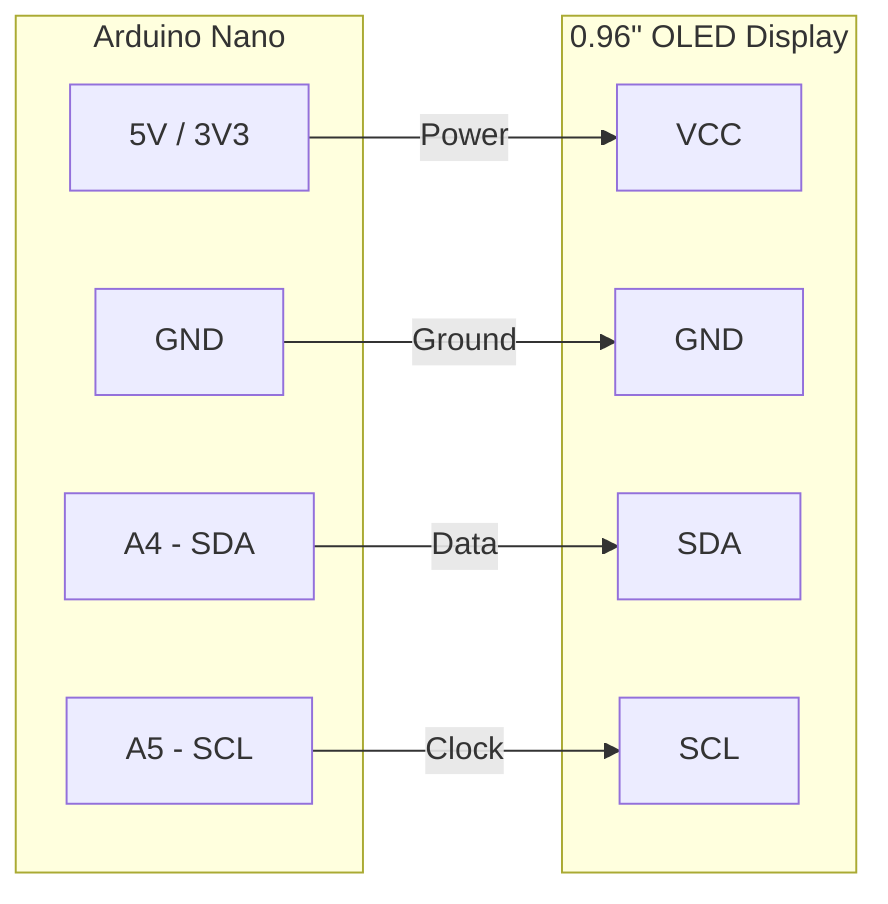

# 🤖 Mini OLED Display Animation (Robotics & IoT)
> **Designed & Developed with ❤️ by // Ankit Satnami**

Welcome to the **Mini OLED Display Animation** project! This repository provides a dynamic, animated "eye" display perfect for giving a personality to your robotics, IoT devices, ESP32, and Arduino projects. 

Whether you're building a desktop companion robot, an interactive smart-home hub, or an ESP32-powered wearable, these OLED eyes will bring your hardware to life!

---

## 🌟 Key Features

- **👀 Expressive Animations**: Wakeup, sleep, blink, happy, and random saccade movements.
- **🛠️ Hardware Agnostic**: Supports Arduino Nano, Uno, ESP32, ESP8266, and Raspberry Pi Pico.
- **📚 Library Support**: Compatible with both `U8G2` and `Adafruit_SSD1306` drivers for maximum flexibility.
- **🌐 IoT & Serial Ready**: Send commands over Serial (USB/Bluetooth/WiFi via ESP32) to trigger animations dynamically based on sensor inputs or network commands.
- **🐍 Python Integration**: Includes a Python script to control the eyes via Serial - perfect for Raspberry Pi or PC-to-Microcontroller communication.


## 🔌 Circuit & Wiring Diagram

Wiring the OLED to an Arduino Nano is very simple via the I2C interface:



**Pin Mapping Reference:**
- **VCC** -> 5V (or 3.3V depending on your display's rating)
- **GND** -> GND
- **SDA** -> A4 (Arduino Nano/Uno) or GPIO 21 (ESP32)
- **SCL** -> A5 (Arduino Nano/Uno) or GPIO 22 (ESP32)

### 📸 Circuit References
- **Arduino Nano**: <br/> 
- **Arduino Uno**: <br/> 
- **ESP32**: <br/> 


## 📡 Serial Commands (IoT / Robotics Integration)

You can trigger specific animations by sending commands over the serial monitor (115200 baud rate) or via your IoT network logic. 
Send `A` followed by the animation index (e.g., `A0`, `A6`).

| Command | Animation |
|---------|-----------|
| `A0`    | Wakeup    |
| `A1`    | Reset     |
| `A2`    | Move Right|
| `A3`    | Move Left |
| `A4`    | Blink Long|
| `A5`    | Blink Short|
| `A6`    | Happy     |
| `A7`    | Sleep     |
| `A8`    | Random Saccade |

---

## 🐍 Python Control

Use the provided Python script `python/example.py` to control the display directly from a Raspberry Pi or PC.

```bash
pip install pyserial
python python/example.py --port COM4
```

---

## 🤝 Credits & Shoutouts
- **Original Concept**: intellar.ca
- **Robotics/IoT Customization & Redesign**: // Ankit Satnami

If you use this in your robotics or IoT project, feel free to give a shoutout! 🚀
